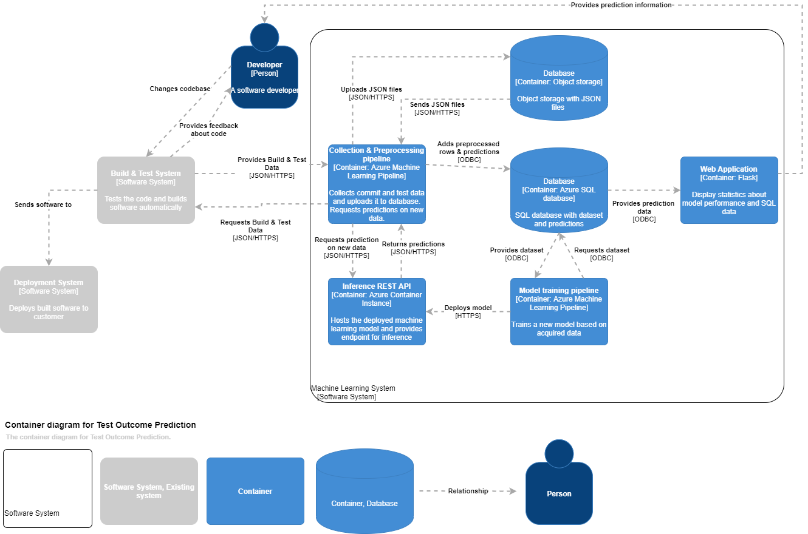
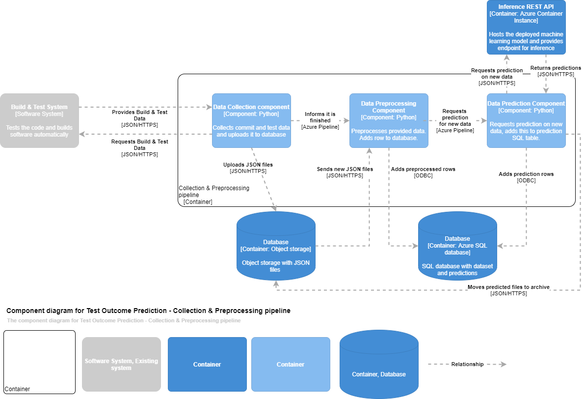
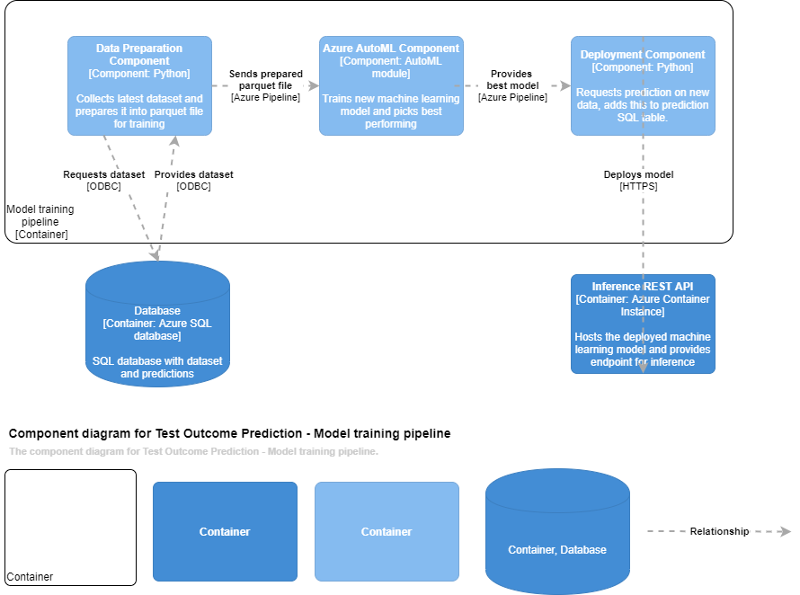

# Test Outcome Prediction


Test Outcome Prediction uses data from Jenkins builds, Jenkins [ChangeSet](https://javadoc.jenkins.io/plugin/git/hudson/plugins/git/GitChangeSet.html)
and GitHub commit data to predict the outcomes of unit tests before they are run. It does this using Azure Automated 
Machine Learning. The goal is to save test time on running tests with a low chance of finding bugs. The predictions
are saved in an SQL database to monitor model performance.

Furthermore, it assists in creating a dataset to enable the predictions if this dataset is not available yet.

This Proof of Concept uses Microsoft Azure services, but the idea and techniques can be used in combination with other 
services as desired. The project can then serve as a template to build on.

## Motivation
This Proof of Concept was created by [Jim Stam](https://github.com/JimStam) as part of the bachelor's thesis Computer Science at [NGTI] (https://www.ngti.nl/en/)  and 
Rotterdam University of Applied Sciences.

**PLEASE NOTE:** This project is a proof of concept and may contain unforeseen bugs. It provides a starting point for 
predicting automated test outcomes with Azure Automated Machine Learning.

## Tech used
**Built with:**
  * Python
  * Azure Machine Learning
  
**Recommended:**
  * Jenkins
  
## Structure
```
|---azure_communication -> Functions to facilitate communication with Azure
|---azure_pipeline_creation -> Files to setup pipeline on Azure
|---azure_pipeline_steps -> Files for individual steps in the Azure pipeline
|---images -> Images used in ReadMe
|---resources -> Additional functions used throughout the project
```
  
## Example
A commit is made, which is then built on Jenkins. The following files were changed:
  * data.json
  * login.swift
  * readme.md
  
Jenkins sends a request, containing basic information, for a prediction to an endpoint. Should this build be tested?
```json
{
    "build": "10",
    "project": "prediction-project",
    "jenkins": "Prediction-project-builder"
}
```

The endpoint will respond with a prediction. Additionally, it will compare it to the real result in case
the dataset is still being built and the model refined
```json
{
    "project": "prediction-project",
    "prediction": "SUCCESS",
    "real result": "SUCCESS"
}
```

The predictions are based on the following Machine Learning Features:
  * Project name
  * Amount of times a file has been changed
  * Amount of owners a file has had
  * Amount of commits the developer of the commit has
  * Amount of files changed in the commit
  * File extensions changed
  
For this commit, the row in the dataset would look like this:
project_name | change_frequency | max_owners | dev_commits | file_count | swift | pdf | md | xib | json
--- | --- | --- | --- | --- | --- | --- | --- | --- | --- | 
project-1 | 12 | 4 | 330 | 3 | 1 | 0 | 1 | 0 | 1

## Usage
A few steps are needed to use the Proof of Concept.

Below is detailed information about all the steps. Changes required in the code have also been marked with a TODO for
convenience. Something not working? Check if all TODO's have been completed. 

### Setting up Azure
First [create an Azure Machine Learning (ML) Workspace](https://docs.microsoft.com/en-us/azure/machine-learning/tutorial-1st-experiment-sdk-setup)

Then, [download the config.json](https://docs.microsoft.com/en-us/azure/machine-learning/how-to-configure-environment#workspace) See [config_example.json](config_example.json) for how it should look.

Optionally, [create an Azure SQL database](https://docs.microsoft.com/en-us/azure/azure-sql/database/single-database-create-quickstart?tabs=azure-portal)
it is also possible to use an existing SQL database.

### Decide which projects to use
Decide which projects you want to start creating predictions for. The projects ideally should use automated tests 
configured on Jenkins and get tested regularly. 

Fill in [projects.json](projects.json) with the required information. These are the names of the project on GitHub
and the corresponding project on Jenkins.

### Configure SQL database
Two tables are needed to run Test Outcome Prediction. One to host the dataset, and one to save the predictions which 
can be used to monitor the performance of the model.

**Dataset table setup**
project_name | change_frequency | max_owners | dev_commits | file_count | swift | pdf | md | xib | json
--- | --- | --- | --- | --- | --- | --- | --- | --- | --- | 
project-1 | 12 | 4 | 330 | 3 | 1 | 0 | 1 | 0 | 1

The amount of file extensions depends on project type. Ideally, all file extensions found in a particular project
have a separate column. This helps with training the model. (See [one-hot-encoding](https://hackernoon.com/what-is-one-hot-encoding-why-and-when-do-you-have-to-use-it-e3c6186d008f) for the reason)

**Predictions table setup**
id (optional) | project | prediction | real_result 
--- | --- | --- | --- |
1 | project-1 | FAILURE | FAILURE 
2 | project-2 | SUCCESS | SUCCESS

After creating the tables, change the table names to the correct ones in [sql.py](resources/sql.py). Also ensure that the 
query/prepared statement contained in [sql.py](resources/sql.py) has the same amount of "?" as the amount of columns.

### Config variables
All variables needed are contained in config_example.ini. 

To generate a GitHub API key refer to [GitHub Help](https://help.github.com/en/github/authenticating-to-github/creating-a-personal-access-token-for-the-command-line). Make sure the token has FULL access to 'repo'.
To generate a Jenkins API key refer to [Jenkins](https://www.jenkins.io/blog/2018/07/02/new-api-token-system/)
To find the AzureConnection key refer to [Microsoft Docs](https://docs.microsoft.com/en-us/azure/storage/common/storage-account-keys-manage?tabs=azure-portal)

After creating the Register, train and deploy pipeline an scoring endpoint is created automatically. In the Azure 
Machine Learning studio go to Endpoints -> Real-time endpoints to find the scoring URL and scoring endpoint API key.

### Configure training
The settings for training the model can be changed in [pipelines.py](azure_communication/pipelines.py). More information about the available
settings can be found in the [Azure Docs](https://docs.microsoft.com/en-us/azure/machine-learning/how-to-configure-auto-train)

### Structure blob storage
Open the blob storage which was created as part of the Azure ML Workspace. Optionally, use the [Azure Storage Explorer](https://azure.microsoft.com/en-us/features/storage-explorer/)
Create directories according to the following schema:
```
|---project-1
|---project-2
|---archive
    |---project-1
    |---project-2    
```
JSON data which needs to be preprocessed is placed its project folder. Once it is preprocessed, it is moved to the 
archive in its respective project folder.

### Structure temp folders
In [the collection folder](azure_pipeline_steps/collection) and [the preprocessing folder](azure_pipeline_steps/preprocessing)
there is a folder called "temp". Create empty folders here for each project, with the same name as used on the build &
test system. 

### Create pipelines
First run 
```shell script
pip install -r requirements.txt
```

Run [collection_and_preprocessing.py](azure_pipeline_creation/collection_and_preprocessing.py) and
[register_train_deploy.py](azure_pipeline_creation/register_train_deploy.py) to create two pipelines on Azure.

At first the collection and preprocessing pipeline might fail. This is because there is no scoring pipeline yet.
After running register_train_deploy, add the scoring endpoint URL and API key to Config.ini. Then run the 
collection_and_preprocessing again.



**Collection and preprocessing** will collect Jenkins data and preprocess it into data for training. The data will be 
saved in the SQL database. It moves the preprocessed files to the BLOB archive.


**Register, train and deploy** will take the latest data from the SQL database, pass this to the Azure Automated Machine
Learning and take the best trained model and deploy this to an endpoint. This endpoint can then be used to make 
predictions as seen in [Example](#Example). Before running this, configure score.py. (See relevant section)


### Configure score.py
In the init() function in [score.py](azure_pipeline_steps/deploy/server_files/score.py), fill in the correct file_extensions
used in your project. It is also possible to change the desired model_name, although this is not necessary. For more
information about the score.py file, see [Azure Docs](https://docs.microsoft.com/en-us/azure/machine-learning/how-to-deploy-existing-model)

After training the model, it is possible to download the score.py from the Azure Machine Learning Studio by using the
"Models" tab. Paste the input sample into your own score.py. This ensures the endpoint knows how to handle the 
incoming data correctly.


